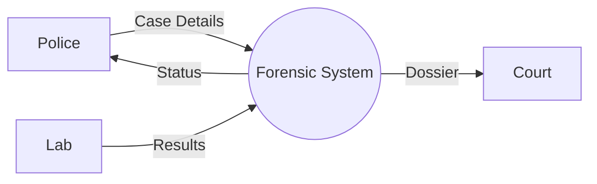
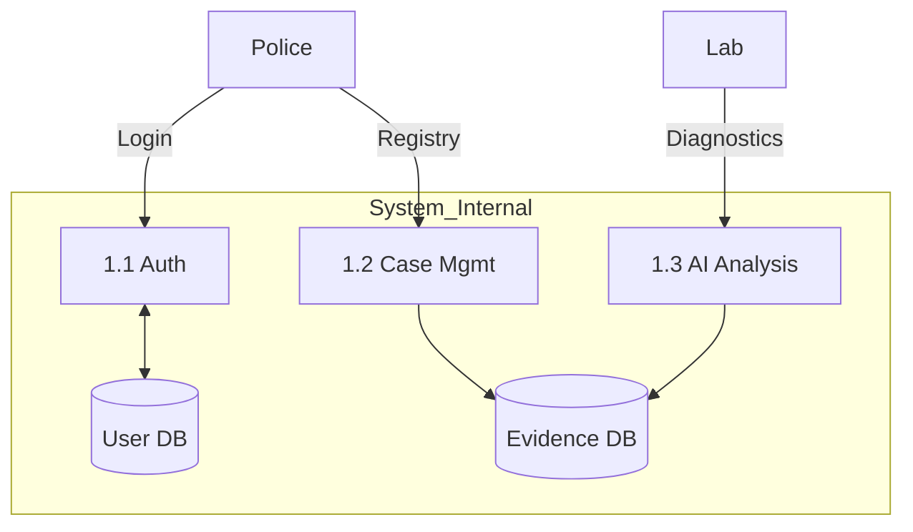

# Forensic Management System: DFD Creation Workflow

This guide provides a structured approach to creating **Level-0 (Context)** and **Level-1 (Functional)** Data Flow Diagrams (DFDs) for the forensic platform.

---

## 1. Core Notations (Gane-Sarson)

| Component | Visual Representation | Description |
| :--- | :--- | :--- |
| **Process** | Rounded Rectangle / Circle | A function that transforms data. |
| **External Entity** | Square / Rectangle | Sources or destinations of data (e.g., Police, Lab). |
| **Data Store** | Open-ended Rectangle | Where data is stored at rest (e.g., Database). |
| **Data Flow** | Arrow | The path information takes between other components. |

---

## 2. Level-0 DFD: The Context Diagram
**Objective:** Define the system's scope and its relationship with external actors.

### Step-by-Step Workflow
1.  **Centralize the System:** Draw a single process in the center labeled "Forensic Management System (0.0)".
2.  **Identify Entities:** Map out the external roles interacting with the system:
    *   **Police**: FIR Submissions, Case Tracking.
    *   **Evidence Collector**: Field Logs, Evidence Registry.
    *   **Lab Technician**: Diagnostic results, Lab reports.
    *   **Judiciary/Court**: Dossier review, Legal notes.
3.  **Map External Flows:** Draw arrows for primary inputs and outputs.
    *   *Input Examples:* `Case Data`, `Evidence Metadata`, `Lab Results`.
    *   *Output Examples:* `Case Status Updates`, `Final Forensic Dossier`.

> [!IMPORTANT]
> **Rule of Level-0:** Never show Data Stores (Databases). The system is a "Black Box."

---

## 3. Level-1 DFD: Functional Decomposition
**Objective:** Reveal the internal logic, main modules, and data persistence layers.

### Step-by-Step Workflow
1.  **Decompose the Process:** Break the 0.0 system into its primary functional modules:
    *   `1.1` **User Authentication**: Validating roles and access.
    *   `1.2` **Case Management**: Handling registration and status.
    *   `1.3` **Forensic Intelligence**: AI processing (Llama 3.3) and Lab diagnostics.
    *   `1.4` **Reporting Engine**: Generating legal-ready dossiers.
2.  **Integrate Data Stores:** Add the databases identified in the backend:
    *   `D1`: **User Registry** (Credentials/Roles).
    *   `D2`: **Evidence Vault** (Physical and digital records).
    *   `D3`: **Forensic Insights** (AI verdicts, risk scores).
3.  **Trace Internal Movement:** Show how data flows between processes and stores.
    *   *Path:* `Lab Data` -> `Process 1.3` -> (Write) -> `D3`.

### The Balancing Rule
Every flow entering or leaving the system in **Level-0** must also appear in **Level-1**. If a flow disappears or a new one appears to an external entity, the diagrams are "unbalanced."

---

## 4. Visual Representation (Mermaid)

### Level-0 Concept

### Level-1 Concept

