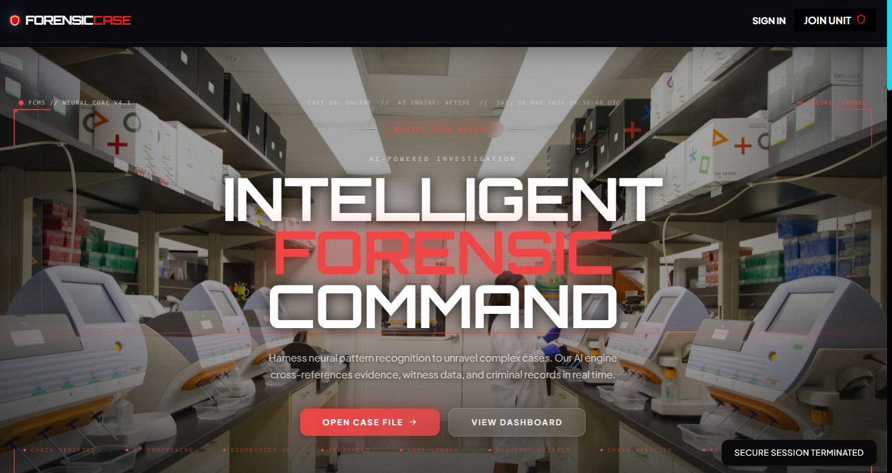
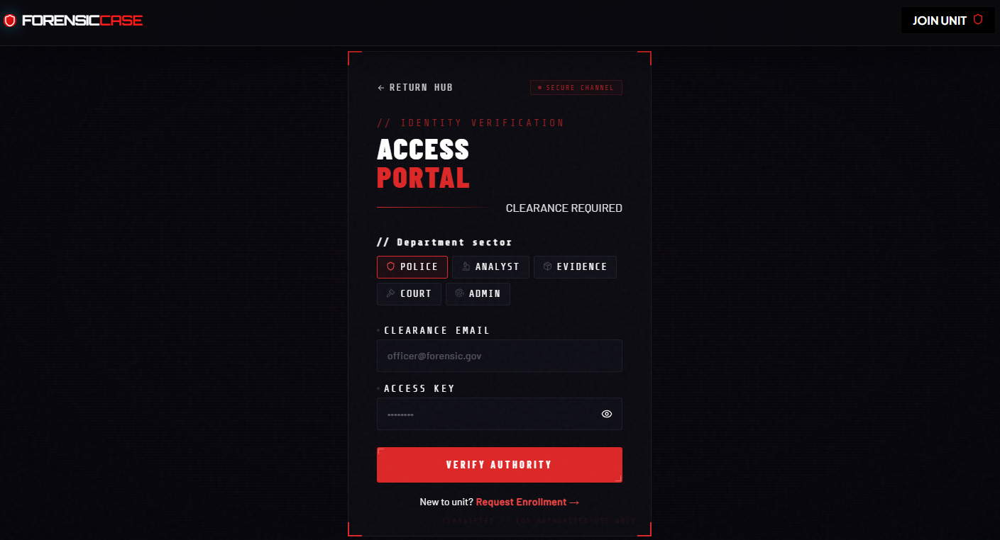
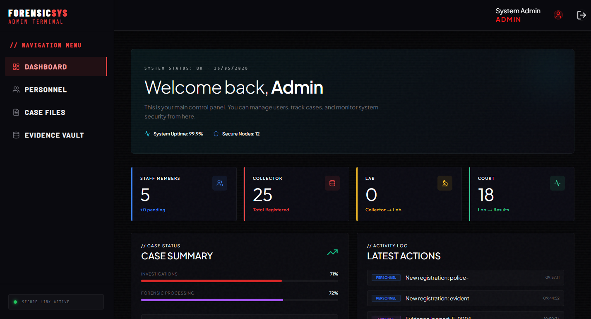
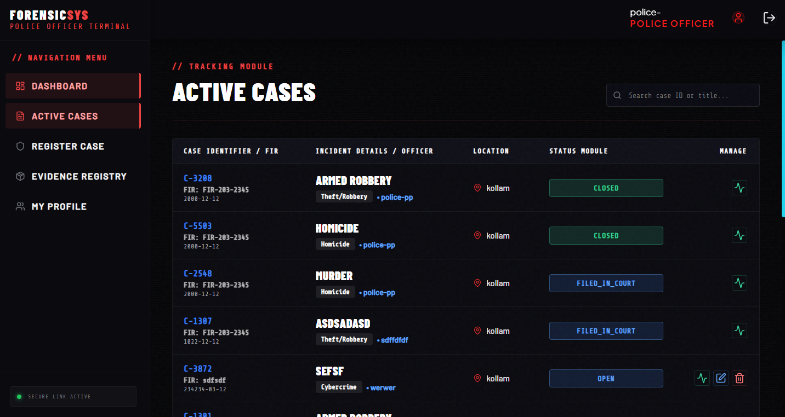
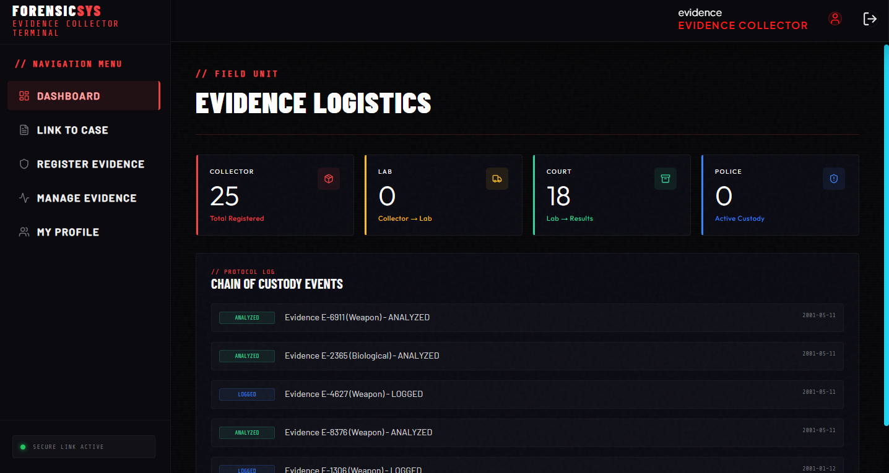
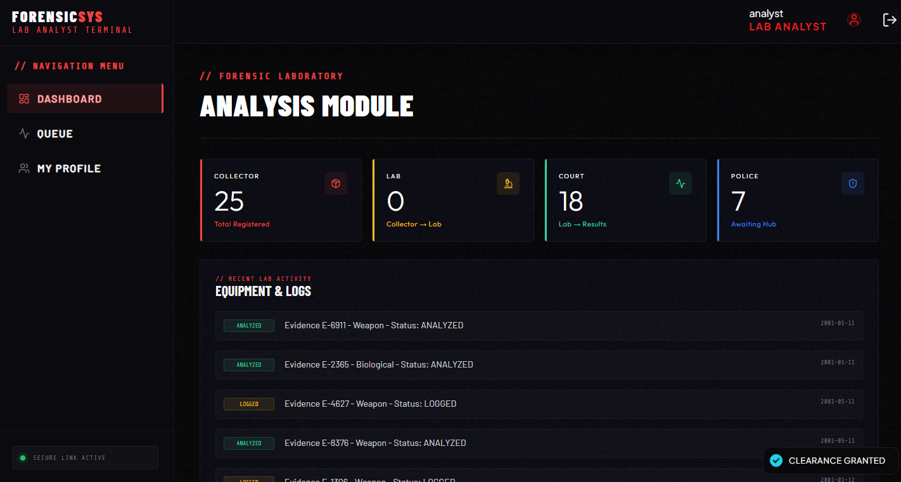
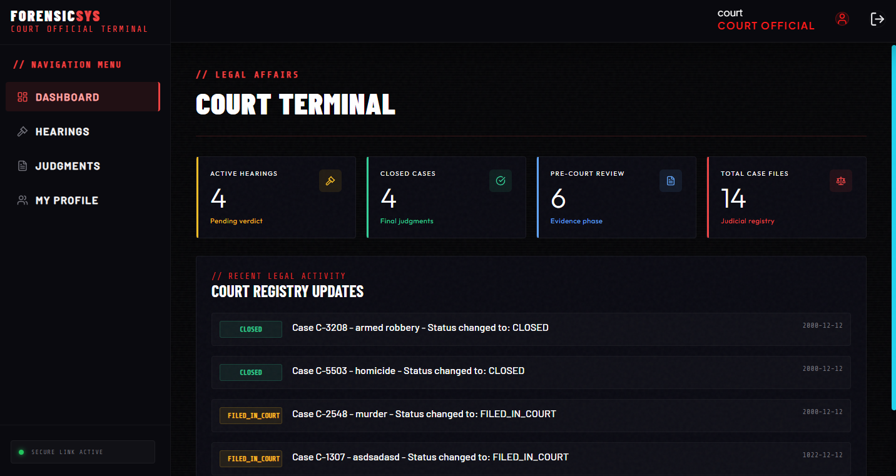

# FCMS - Forensic Case Management System

## Abstract

**FCMS (Forensic Case Management System)** is a state-of-the-art, AI-powered investigation platform designed for modern law enforcement and forensic agencies. Built with a high-performance MERN stack and real-time synchronization via Socket.io, the system provides a unified "command center" for police officers, evidence collectors, lab analysts, and court officials. 

The platform features neural network-driven suspect correlation, immutable chain-of-custody tracking, and a premium glassmorphic user interface designed for mission-critical operations. By bridging the gap between field investigation and courtroom presentation, FCMS ensures that every piece of evidence is cryptographically secured and every lead is intelligently analyzed.

---

## Step By Step Guide to run FCMS

### Step 1: Prerequisites
First, ensure you have the following installed on your system:
- **Node.js** (Version 18.x or higher)
- **MongoDB** (Local instance or MongoDB Atlas)
- **npm** (comes with Node.js)

### Step 2: Project Structure
The repository is structured to separate concerns between the server-side logic and the client-side interface:

**Project Layout:**
```text
forensic/
├── backend/            # Express.js API & Socket.io Server
│   ├── config/         # Database and Socket configurations
│   ├── models/         # Mongoose Schemas
│   ├── routes/         # API Endpoints
│   └── uploads/        # Secure evidence storage
├── frontend/           # React.js Application
│   ├── src/            # Components, Hooks, and Styles
│   └── public/         # Static assets
└── readme.md           # Project documentation
```

### Step 3: Configure Backend Environment
Navigate to the `backend/` directory and create a `.env` file to store your configuration. This file is required for the server to connect to the database and authenticate users.

**File Location:** `backend/.env`

```bash
# Create .env file in the backend directory with these variables:
PORT=4000
MONGO_URI=''
JWT_SECRET=''
ADMIN_EMAIL=''
ADMIN_PASSWORD=''
GROQ_URL=''
GROQ_API_KEY=''
```

### Step 4: Install Dependencies
Install the required packages for both the backend and frontend.

**Backend:**
```bash
cd backend
npm install
```

**Frontend:**
```bash
cd frontend
npm install
```

### Step 5: Database & Verification
Ensure your MongoDB service is running. The application will automatically create the necessary collections upon first connection. Verify that the `uploads` directory exists in the `backend` folder to handle evidence file storage.

### Step 6: Launch the Servers
You need to run both servers simultaneously for the full experience.

**Run Backend (Port 4000):**
```bash
cd backend
npm start
```

**Run Frontend (Port 3000):**
```bash
cd frontend
npm start
```

### Step 7: Use the Application
Open your web browser and navigate to `http://localhost:3000`. 
1. **Authentication**: Register a new account and select your role (e.g., Police Officer, Lab Analyst).
2. **Command Center**: Access your specific dashboard to monitor live data feeds.
3. **Collaboration**: Use the secure channel to log evidence, process lab reports, and manage case files with real-time updates across all connected agencies.


## Project Screenshots

### Landing Page


### Login Page


### Admin Dashboard


### Police Officer Portal


### Evidence Collection System


### Laboratory Analysis Suite


### Court & Legal Overview

